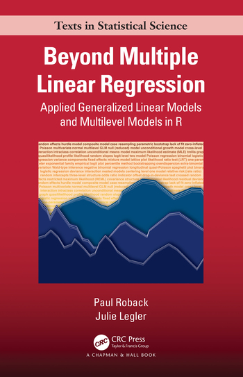

```{r echo=FALSE, message=FALSE, warning=FALSE}
library(tidyverse)
```

class: middle

# Welcome!

---

## Teaching Team

**Instructor**:

- Professor Maria Tackett: [maria.tackett@duke.edu](mailto:maria.tackett@duke.edu)

**Teaching Assistants**: 

- Jose San Pliego Martin 
- Raphaël Morosomme

---

## Course logistics

**Lectures**

- Mondays and Wednesdays, 3:30 - 4:45pm, Link #5


**Labs** 

- Thursdays, 3:30 - 4:45pm, Link #5

<br> 

**All class meetings on Zoom until January 18**

---

## Generalized Linear Models

*In statistics, a generalized linear model (GLM) is a flexible generalization of ordinary linear regression. The GLM generalizes linear regression by allowing the linear model to be related to the response variable via a link function and by allowing the magnitude of the variance of each measurement to be a function of its predicted value.* 

.pull-right[-[Wikipedia](https://en.wikipedia.org/wiki/Generalized_linear_model)]

---

## What we're covering this semester 

**Generalized Linear Models (Ch 1 - 6)**

- Introduce models for non-normal response variables
- Estimation, interpretation, and inference
- Mathematical details showing how GLMs are connected

**Modeling correlated data (Ch 7 - 11)**

- Introduce multilevel models for correlated and longitudinal data
- Estimation, interpretation, and inference
- Mathematical details, particularly diving into covariance structures
---

class: inverse, middle

## Meet your classmates!


---

## Meet your classmates! (6 minutes)

- Quick introductions - Name and year
- Choose a reporter
  - Need help choosing? Person with birthday closest to January 5. 
- Identify 8 things everyone in the group has in common
  - Not being a Duke student
  - Not clothes (we're all wearing socks)
  - Not body parts (we all have a nose)

<br>

**Reporter will share list with the class**

---

class: inverse, middle

## More about the course...

---

## What background is assumed for the course?

**Pre-reqs**

- STA 210 and STA 230 / STA 240

**Background knowledge** 

.pull-left[
- Statistical content
  - Linear and logistic regression 
  - Statistical inference
  - Basic understanding of random variables
]

.pull-right[
- Computing 
  - Using R for data analysis
  - Writing reports using R Markdown
  - Version control and collaboration using GitHub
]
---

## Course Toolkit

.pull-left[
- **Website**
[sta310-sp22.netlify.app](https://sta310-sp22.netlify.app/)
  - Central hub for the course

- **Sakai**: [sakai.duke.edu](https://sakai.duke.edu)
  - Gradebook
  - Announcements
]

.pull-right[

- **GitHub**: [github.com/sta310-sp22](https://github.com/sta310-sp22)
  - Work on assignments
  - Feedback on project
  
- **Gradescope**: [gradescope.com](https://www.gradescope.com)
  - Submit assignments
]

---

## Class Meetings 

.pull-left[
**Lectures**

- Some traditional lecture
- Short individual and group activities 
- Bring fully-charged laptop
]

.pull-right[
**Labs (start January 13)**

- Work on class assignments with TA support
- Work on projects with teammates
]

<br>

.center[
**Attendance is expected (if you are healthy!)**
]

---

## Textbook

.pull-left[

]

.pull-right[
*Beyond Multiple Linear Regression* by Paul Roback and Julie Legler

- Available [online](https://bookdown.org/roback/bookdown-BeyondMLR/)
- Hard copies available for purchase
]

---

## Using R / RStudio

`r emo::ji("one")` Install RStudio on your laptop
  
  - [Click here](https://github.com/sta310-sp22/computing/blob/main/README.md) for instructions


**or**

`r emo::ji("two")` Access RStudio through [Docker container](https://vm-manage.oit.duke.edu/containers) provided by Duke OIT
  - Reserve a generic **RStudio** container (there is no course specific container)

---

class: inverse, middle

## Activities & Assessments

### Prepare - Practice - Perform

---

## Activities & assessments

**Readings**

  - Primarily from *Beyond Multiple Linear Regression* 
  - Recommend reading assigned text before lecture

<br> 

**Homework**
  - Individual assignments
  - Lowest dropped at end of semester

---

## Activities & assessments

**Quizzes**
  - Covers content from readings and assignments since the previous quiz
  - Lowest dropped at end of semester

---

## Activities & assessments

**Mini-projects**

- Mini-project 01: Focused on models for non-normal response variables
- Mini-project 02: Focused on models for correlated data
- Both have presentation & short write up
- Both are team-based

**Final project**

- Use any model(s) you've learned to analyze data set of your choice
- Write up
- Individual project

---

## Grading

Final grades will be calculated as follows


| Category              | Percentage |
|-----------------------|------------|
| Homework              | 40%        |
| Mini-project 01       | 10%        |
| Mini-project 02       | 10%        |
| Final project         | 25%        |
| Quizzes               | 15%        |

<br>

See [syllabus](https://sta310-sp22.netlify.app/syllabus/#grading) for letter grade thresholds.

---

class: inverse, middle

## Course community & resources

---

## Course community

- Uphold the Duke Community Standard: 
> - I will not lie, cheat, or steal in my academic endeavors;
>- I will conduct myself honorably in all my endeavors; and
> - I will act if the Standard is compromised.

<br>

- Commit to respect, honor, and celebrate our diverse community 

- Commit to being part of a learning environment that is welcoming and accessible to everyone


---

## Resources 

- **Office hours** to meet with a member of the teaching team.
  - Find the schedule in the [syllabus](https://sta310-sp22.netlify.app/syllabus/)
  - Regular office hours begin January 18

- **Github Discussion** for questions about course logistics, content, and assignments

- **Email** Prof. Tackett for private questions regarding personal matters or grades. 
  - Please put **STA 310** in the subject line 

.small[See the [syllabus](https://sta310-sp22.netlify.app/syllabus/#additional-support) and [support](https://sta310-sp22.netlify.app/help/) page for additional academic and mental health and wellness resources]

---

class: inverse, middle, center

## Questions? 

### "Raise your hand" or post in the Zoom chat

---

## Before Monday

- **No lab on Thursday, January 6. Lab starts January 13.**

- Complete the [All About You survey](https://duke.qualtrics.com/jfe/form/SV_1X1ryORVK6JJwkm)
  - Will submit your GitHub username on the survey. If you don't have a GitHub account, [click here](https://github.com/sta310-sp22/computing/blob/main/github-username.md) for more info.

- Read the [syllabus](https://sta310-sp22.netlify.app/syllabus/).

- [Week 01 reading](https://sta310-sp22.netlify.app/readings/#week-01-jan-10---14): BMLR Chapter 1

- Start [installing RStudio and configuring Git](https://github.com/sta310-sp22/computing/blob/main/README.md)    
  - Will need by January 13 lab
