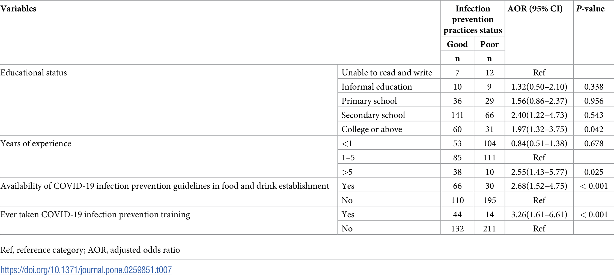

```{r setup, include = F}
knitr::opts_chunk$set(warning = FALSE, 
                      message = FALSE, 
                      fig.width = 8,
                      fig.asp = 0.618, 
                      fig.retina = 3, 
                      dpt = 300, 
                      out.width = "70%",
                      fig.align = "center")

ggplot2::theme_set(ggplot2::theme_bw(base_size = 16))

colors <- tibble::tibble(green = "#B5BA72")
```


```{r echo=FALSE, message=FALSE, warning=FALSE}
library(tidyverse)
library(tidymodels)
library(GGally)
library(xaringanExtra)
library(knitr)
library(patchwork)
library(viridis)
library(ggfortify)
library(gridExtra)
```

```{r xaringan-panelset, echo=FALSE}
xaringanExtra::use_panelset()
```

class: middle, center

## [Click here for PDF of slides](12-logistic.pdf)

---


## Announcements

- Fill out [mini-project 01 team evaluation](https://forms.office.com/r/MuLAg4y7dY) by **TODAY at 11:59pm**

- Quiz 02 on Gradescope **due Fri, Feb 18 at 11:59pm**


---

## Learning goals 

- Identify Bernoulli and binomial random variables

- Write GLM for binomial response variable 

- Interpret the coefficients for a logistic regression model 

- Visualizations for logistic regression

---

class: middle, inverse

## Basics of logistic regression

---

## Bernoulli + Binomial random variables 

Logistic regression is used to analyze data with two types of responses: 

- **Binary**: These responses take on two values success $(Y = 1)$ or failure $(Y = 0)$, yes $(Y = 1)$ or no $(Y = 0)$, etc.

$$P(Y = y) = p^y(1-p)^{1-y} \hspace{10mm} y = 0, 1$$

- **Binomial**: Number of successes in a Bernoulli process, $n$ independent trials with a constant probability of success $p$. 

$$P(Y = y) = {n \choose y}p^{y}(1-p)^{n - y} \hspace{10mm} y = 0, 1, \ldots, n$$

--

In both instances, the goal is to model $p$ the probability of success.

---

## Binary vs. Binomial data 

.question[
.midi[For each example, identify if the response is a Bernoulli or Binomial response:]

1. .midi[Use median age and unemployment rate in a county to predict the percent of Obama votes in the county in the 2008 presidential election.]

2. .midi[Use GPA and MCAT scores to estimate the probability a student is accepted into medical school.]

3. .midi[Use sex, age, and smoking history to estimate the probability an individual has lung cancer.]

4. .midi[Use offensive and defensive statistics from the 2017-2018 NBA season to predict a team's winning percentage.]

[Click here](https://forms.gle/URGd5ycAxwXhJKQZ9) to submit your responses.

]


```{r echo = F}
library(countdown)
countdown(minutes = 2, seconds = 30,
          margin = "1.25%")
```

---

## Logistic regression model 

.eq[
$$\log\Big(\frac{p}{1-p}\Big) = \beta_0 + \beta_1x_1 + \beta_2x_2 + \dots + \beta_px_p$$
]

--

- The response variable, $\log\Big(\frac{p}{1-p}\Big)$, is the log(odds) of success, i.e. the logit

--

- Use the model to calculate the probability of success $$\hat{p} = \frac{e^{\beta_0 + \beta_1x_1 + \beta_2x_2 + \dots + \beta_px_p}}{1 + e^{\beta_0 + \beta_1x_1 + \beta_2x_2 + \dots + \beta_px_p}}$$

--


- When the response is a Bernoulli random variable, the probabilities can be used to classify each observation as a success or failure

---

## Logistic vs linear regression model 

```{r, OLSlogistic, fig.align="center", out.width="60%", fig.cap='Graph from BMLR Chapter 6', echo=FALSE, warning=FALSE, message=FALSE}

set.seed(0)
dat <- tibble(x=runif(200, -5, 10),
                  p=exp(-2+1*x)/(1+exp(-2+1*x)),
                  y=rbinom(200, 1, p),
                  y2=.3408+.0901*x,
                  logit=log(p/(1-p)))
dat2 <- tibble(x = c(dat$x, dat$x),
               y = c(dat$y2, dat$p),
               `Regression model` = c(rep("linear", 200),
                                      rep("logistic", 200)))

ggplot() + 
  geom_point(data = dat, aes(x, y)) +
  geom_line(data = dat2, aes(x, y, linetype = `Regression model`, 
                             color = `Regression model`)) + 
  labs(title = "Linear vs. logistic regression models for binary response data") + 
  scale_colour_manual(name = 'Regression model',
                      values = c('blue', 'red'), 
                      labels = c('linear', 'logistic'), guide ='legend')

#ggplot(dat, aes(x = x)) +
#  geom_point(aes(y = y)) +
#  geom_smooth(aes(y = y, color = "blue"), method = "lm", 
#              linetype = 1, se=FALSE) +
#  geom_line(aes(y = p, color = "red"), linetype = 2) +
#  scale_colour_manual(name = 'Regression model', 
#         values = c('blue', 'red'), 
#         labels = c('linear', 'logistic'), guide = 'legend')
```

---

## Logit link 

Bernoulli and Binomial random variables can be written in one-parameter exponential family form, $f(y;\theta) = e^{[a(y)b(\theta) + c(\theta) + d(y)]}$

**Bernoulli**

$$f(y;p) = e^{y\log(\frac{p}{1-p}) + \log(1-p)}$$

**Binomial** 

$$f(y;n,p) = e^{y\log(\frac{p}{1-p}) + n\log(1-p) + \log{n \choose y}}$$

--

They have the same canonical link $b(p) = \log\big(\frac{p}{1-p}\big)$

---

## Assumptions for logistic regression 

The following assumptions need to be satisfied to use logistic regression to make inferences

`r emo::ji("one")` $\hspace{0.5mm}$ **Binary response**: The response is dichotomous (has two possible outcomes) or is the sum of dichotomous responses

`r emo::ji("two")` $\hspace{0.5mm}$ **Independence**: The observations must be independent of one another 

`r emo::ji("three")` $\hspace{0.5mm}$ **Variance structure**: Variance of a binomial random variable is $np(1-p)$ $(n = 1 \text{ for Bernoulli})$ , so the variability  is highest when $p = 0.5$

`r emo::ji("four")` $\hspace{0.5mm}$  **Linearity**: The log of the odds ratio, $\log\big(\frac{p}{1-p}\big)$, must be a linear function of the predictors $x_1, \ldots, x_p$

---

## COVID-19 infection prevention practices at food establishments

Researchers at Wollo Univeristy in Ethiopia conducted a study in July and August 2020 to understand factors associated with good COVID-19 infection prevention practices at food establishments. Their study is published in [Andualem et al. (2022)](https://journals.plos.org/plosone/article?id=10.1371/journal.pone.0259851#ack) 

They were particularly interested in the understanding implementation of prevention practices at food establishments, given the workers' increased risk due to daily contact with customers. 

.footnote[.small[Andualem, A., Tegegne, B., Ademe, S., Natnael, T., Berihun, G., Abebe, M., ... & Adane, M. (2022). COVID-19 infection prevention practices among a sample of food handlers of food and drink establishments in Ethiopia. PloS one, 17(1), e0259851.]]

---

## The data

*"An institution-based cross-sectional study was conducted among <b>422 food handlers in Dessie City and Kombolcha Town food and drink establishments in July and August 2020.</b> The study participants were selected using a <b>simple random sampling</b> technique. Data were collected by trained data collectors using a pretested structured questionnaire and an on-the-spot observational checklist."*

<br> 

.footnote[.small[Andualem, A., Tegegne, B., Ademe, S., Natnael, T., Berihun, G., Abebe, M., ... & Adane, M. (2022). COVID-19 infection prevention practices among a sample of food handlers of food and drink establishments in Ethiopia. PloS one, 17(1), e0259851.]]

---

## Response variable

*"The outcome variable of this study was the <b>good or poor practices of COVID-19 infection prevention among food handlers</b>. Nine yes/no questions, one observational checklist and five multiple choice infection prevention practices questions were asked with a minimum score of 1 and maximum score of 25. Good infection prevention practice (the variable of interest) was determined for food handlers who scored 75% or above, whereas poor infection prevention practices refers to those food handlers who scored below 75% on the practice questions."* 

<br> 


.footnote[.small[Andualem, A., Tegegne, B., Ademe, S., Natnael, T., Berihun, G., Abebe, M., ... & Adane, M. (2022). COVID-19 infection prevention practices among a sample of food handlers of food and drink establishments in Ethiopia. PloS one, 17(1), e0259851.]]

---

## Results 



.footnote[.small[Andualem, A., Tegegne, B., Ademe, S., Natnael, T., Berihun, G., Abebe, M., ... & Adane, M. (2022). COVID-19 infection prevention practices among a sample of food handlers of food and drink establishments in Ethiopia. PloS one, 17(1), e0259851.]]

---

## Interpreting the results 

- Is the response a Bernoulli or Binomial? 

- What is the strongest predictor of having good COVID-19 infection prevention practices?
  - It's often unreliable to look answer this question just based on the model output. Why are we able to answer this question based on the model output in this case? 
  
- Describe the effect (coefficient interpretation and inference) of having COVID-19 infection prevention policies available at the food establishment. 

- The intercept describes what group of food handlers? 


```{r echo = F}
library(countdown)
countdown(minutes = 4, seconds = 30,
          margin = "1.25%")
```


---


class: middle, center

## Visualizations for logistic regression

---

## Access to personal protective equipment

We will use the data from [Andualem et al. (2022)](https://journals.plos.org/plosone/article?id=10.1371/journal.pone.0259851#ack) to explore the association between age, sex, years of service, and whether someone works at a food establishment with access to personal protective equipment (PPE) as of August 2020. We will use access to PPE as a proxy for wearing PPE. 

```{r echo = F}
covid_df <- read_csv("data/covid-prevention-study.csv") %>%
  rename(age = "Age of food handlers", 
         years = "Years of service", 
         ppe_access = "Availability of PPEs") %>%
  mutate(sex = factor(if_else(Sex == 2, "Female", "Male"))) %>%
  select(age, sex, years, ppe_access) 

covid_df %>% slice(1:5) %>% kable()
```

---

## Exploratory data analysis for binary response

```{r, out.width = "60%"}
library(Stat2Data)
par(mfrow = c(1, 2))
emplogitplot1(ppe_access ~ age, data = covid_df, ngroups = 10)
emplogitplot1(ppe_access ~ years, data = covid_df, ngroups = 5)
```

---

## Exploratory data analysis for binary response

.small[
```{r, out.width = "60%"}
library(viridis)
ggplot(data = covid_df, aes(x = sex, fill = factor(ppe_access))) + 
  geom_bar(position = "fill")  +
  labs(x = "Sex", 
       fill = "PPE Access", 
       title = "PPE Access by Sex") + 
  scale_fill_viridis_d()
```
]

---

## Model results

```{r}
ppe_model <- glm(factor(ppe_access) ~ age + sex + years, data = covid_df, 
                 family = binomial)
tidy(ppe_model, conf.int = TRUE) %>%
  kable(digits = 3)
```

---

## Visualizing coefficient estimates

.small[
```{r}
model_coef <- tidy(ppe_model, exponentiate = TRUE, conf.int = TRUE)
```

```{r, out.width = "55%"}
ggplot(data = model_coef, aes(x = term, y = estimate)) +
  geom_point() +
  geom_hline(yintercept = 1, lty = 2) + 
  geom_pointrange(aes(ymin = conf.low, ymax = conf.high))+
  labs(title = "Exponentiated model coefficients") + 
  coord_flip()
```
]

---

## Acknowledgements

These slides are based on content in 

- [BMLR: Chapter 6 - Logistic Regression](https://bookdown.org/roback/bookdown-BeyondMLR/ch-glms.html)

  