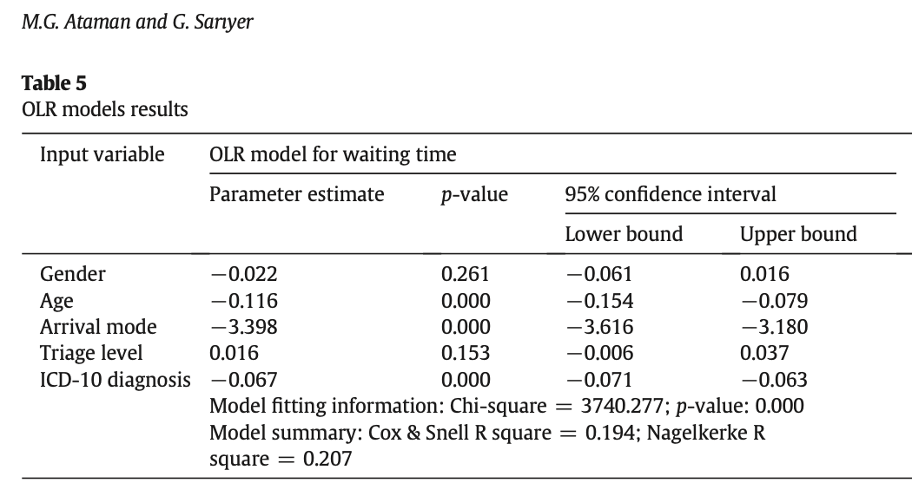
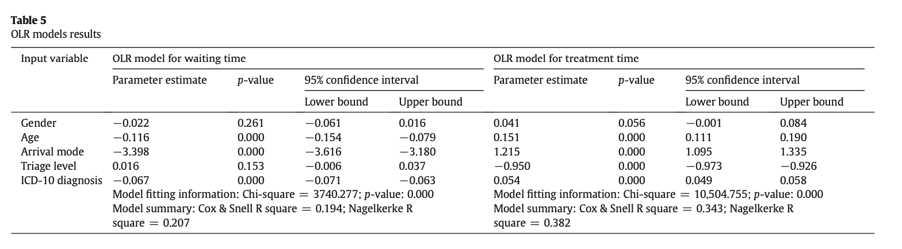

```{r setup, include = F}
knitr::opts_chunk$set(warning = FALSE, 
                      message = FALSE, 
                      fig.width = 8,
                      fig.asp = 0.618, 
                      fig.retina = 3, 
                      dpt = 300, 
                      out.width = "70%",
                      fig.align = "center")

ggplot2::theme_set(ggplot2::theme_bw(base_size = 16))

colors <- tibble::tibble(green = "#B5BA72")
```


```{r echo=FALSE, message=FALSE, warning=FALSE}
library(tidyverse)
library(tidymodels)
library(GGally)
library(xaringanExtra)
library(knitr)
library(patchwork)
library(viridis)
library(ggfortify)
library(gridExtra)
```

```{r xaringan-panelset, echo=FALSE}
xaringanExtra::use_panelset()
```

class: middle, center

## [Click here for PDF of slides](13-logistic-pt2.pdf)

---


## Announcements

- HW 03 **due Mon, Feb 28 at 11:59pm**
  - Released after class

- Mini-Project 01 grades posted in Sakai 
  - See Github issues for feedback on written report 
  
- Mid-semester grades by Wednesday (apologies for the delay! )

---

## Learning goals 

- Fit and interpret logistic regression model for binomial response variable 

- Interpret coefficients and results from an ordinal logistic regression model 

- Summarize GLMs for independent observations

---

class: middle, inverse

### Logistic regression for binomial response variable

---

## Data: Supporting railroads in the 1870s

The data set [`RR_Data_Hale.csv`](data/RR_Data_Hale.csv) contains information on support for referendums related to railroad subsidies for 11 communities in Alabama in the 1870s. The data were originally analyzed as part of a thesis project by a student at St. Olaf College. The variables in the data are 

- `pctBlack`: percentage of Black residents in the county 
- `distance`: distance the proposed railroad is from the community (in miles)
- `YesVotes`: number of "yes" votes in favor of the proposed railroad line 
- `NumVotes`: number of votes cast in the election 

--

**Primary question**: Was voting on the railroad referendum related to the distance from the proposed railroad line, after adjusting for the racial composition of a community?

---

## The data 

```{r}
rr <- read_csv("data/RR_Data_Hale.csv")
rr %>% slice(1:5) %>% kable()
```

---

## Exploratory data analysis

```{r}
rr <- rr %>%
  mutate(pctYes = YesVotes/NumVotes, 
         emp_logit = log(pctYes / (1 - pctYes)))
```

```{r echo = F, out.width = "70%"}
p1 <- ggplot(data = rr, aes(x = distance, y = emp_logit)) + 
  geom_point() + 
  geom_smooth(method  = "lm", se = FALSE) + 
  labs(x = "Distance to proposed railroad", 
       y = " ")
  
p2 <- ggplot(data = rr, aes(x = pctBlack, y = emp_logit)) + 
  geom_point() + 
  geom_smooth(method  = "lm", se = FALSE) + 
  labs(x = "% Black residents", 
       y = "")
p1 + p2 + plot_annotation(title = "Log(odds yes vote) vs. predictor variables")
```
---

## Exploratory data analysis

```{r}
rr <- rr %>%
  mutate(inFavor = if_else(pctYes > 0.5, "Yes", "No"))
```

```{r echo = F, out.width = "70%"}
ggplot(data = rr, aes(x = distance, y = pctBlack, color = inFavor)) + 
  geom_point() + 
  geom_smooth(method  = "lm", se = FALSE, aes(lty = inFavor)) + 
  labs(x = "Distance to proposed railroad", 
       y = "% Black residents",
       title = "% Black residents vs. distance", 
       subtitle = "Based on vote outcome") + 
  scale_color_viridis_d(end = 0.85)
```

Check for potential multicollinearity and interaction effect. 

---

## Model 

Let $p$ be the percent of yes votes in a county. We'll start by fitting the following model: 

$$\log\Big(\frac{p}{1-p}\Big)  = \beta_0 + \beta_1 ~ dist + \beta_2 ~ pctBlack$$

--

**Likelihood** 

$$\begin{aligned}L(p) &= \prod_{i=1}^{n} {m_i \choose y_i}p_i^{y_i}(1 - p_i)^{m_i - y_i} \\ 
&= \prod_{i=1}^{n} {m_i \choose y_i}\Big[\frac{e^{\beta_0 + \beta_1 ~ dist_i + \beta_2 ~ pctBlack_i}}{1 + e^{\beta_0 + \beta_1 ~ dist_i + \beta_2 ~ pctBlack_i}}\Big]^{y_i}\Big[\frac{1}{e^{\beta_0 + \beta_1 ~ dist_i + \beta_2 ~ pctBlack_i}}\Big]^{m_i - y_i} \\\end{aligned}$$

Use IWLS to find $\hat{\beta}_0, \hat{\beta}_1, \hat{\beta}_2$. 

---

## Model in R

```{r}
rr_model <- glm(cbind(YesVotes, NumVotes - YesVotes) ~ distance + pctBlack, 
                data = rr, family = binomial)
tidy(rr_model, conf.int = TRUE) %>%
  kable(digits = 3)
```
$$\log\Big(\frac{\hat{p}}{1-\hat{p}}\Big)  = 4.22 - 0.292 ~ dist - 0.013 ~ pctBlack$$

.footnote[See Section 6.5 of *Generalized Linear Models with Examples in R* by Dunn and Smyth (available through Duke library) for details on estimating the standard errors.]

---

class: middle 

## Part 1 of `lecture-13.Rmd`


```{r echo = F}
library(countdown)
countdown(minutes = 10, seconds = 00,
          margin = "1.25%")
```


---

## Residuals 

Similar to Poisson regression, there are two types of residuals: Pearson and deviance residuals

--

**Pearson residuals** 

$$\text{Pearson residual}_i = \frac{\text{actual count} - \text{predicted count}}{\text{SD count}} = \frac{Y_i - m_i\hat{p}_i}{\sqrt{m_i\hat{p}_i(1 - \hat{p}_i)}}$$
--

**Deviance residuals** 

$$d_i = \text{sign}(Y_i - m_i\hat{p}_i)\sqrt{2\Big[Y_i\log\Big(\frac{Y_i}{m_i\hat{p}_i}\Big) + (m_i - Y_i)\log\Big(\frac{m_i - Y_i}{m_i - m_i\hat{p}_i}\Big)\Big]}$$
---

## Plot of deviance residuals 

```{r echo = F}
rr_int_model <- glm(cbind(YesVotes, NumVotes - YesVotes) ~ distance + pctBlack +
                      distance*pctBlack, 
                data = rr, family = binomial)
```

```{r}
rr_int_aug <- augment(rr_int_model, type.predict = "response", 
                        type.residuals = "deviance")
```

```{r echo = F}
ggplot(data = rr_int_aug, aes(x = .fitted, y = .resid)) + 
  geom_point() + 
  geom_hline(yintercept = 0, color = "red") + 
  labs(x = "Fitted values", 
       y = "Deviance residuals", 
       title = "Deviance residuals vs. fitted", 
       subtitle = "for model with interaction term")
```

---

## Goodness of fit 

Similar to Poisson regression, the sum of the squared deviance residuals is used to assess goodness of fit. 

$$\begin{aligned} &H_0: \text{ Model is a good fit} \\
&H_a: \text{ Model is not a good fit}\end{aligned}$$

--

- When $m_i$ is large and the model is a good fit $(H_0 \text{ true})$ the residual deviance follows a $\chi^2$ distribution with $n - p$ degrees of freedom. 
  - Recall $n - p$ is the residual degrees of freedom.

--

- If the model fits, we expect the residual deviance to be approximately what value? 

---

class: middle, inverse

## Overdispersion 

---

## Adjusting for overdispersion 

- Overdispersion occurs when there is **extra-binomial variation**, i.e. the variance is greater than what we would expect, $np(1-p)$.

- Similar to Poisson regression, we can adjust for overdispersion in the binomial regression model by using a dispersion parameter $$\hat{\phi} = \sum \frac{(\text{Pearson residuals})^2}{n-p}$$
  -  By multiplying by $\hat{\phi}$, we are accounting for the reduction in information we would expect from independent observations. 

---

## Adjusting for overdispersion

- We adjust for overdispersion using a **quasibinomial** model. 
  - "Quasi" reflects the fact we are no longer using a binomial model with true likelihood. 
  
- The standard errors of the coefficients are $SE_{Q}(\hat{\beta}_j) = \sqrt{\hat{\phi}} SE(\hat{\beta})$
  - Inference is done using the $t$ distribution to account for extra variability 

---

class: middle

## Part 2 of `lecture-13.Rmd`


---

class: middle, inverse

## Predicting emergency department wait and treatment times 

---

## Predicting ED wait and treatment times

[Ataman and Sariyer (2021)](https://sakai.duke.edu/access/content/group/ec265469-bdb3-47a7-beb0-317956b6f86f/ataman-sariyer-2021.pdf) use ordinal logistic regression to predict patient wait and treatment times in an emergency department (ED).  The goal is to identify relevant factors that can be used to inform recommendations for reducing wait and treatment times, thus improving the quality of care in the ED. 

**Data**: Daily records for ED arrivals in August 2018 at a public hospital in Izmir, Turkey. 

**Response variable**: Wait time, a categorical variable with three levels: 
  - Patients who wait less than 10 minutes
  - Patients whose waiting time is in the range of 10-60 minutes
  - Patients who wait more than 60 minutes

<br><br>

.footnote[.small[Ataman, M. G., & Sarıyer, G. (2021). Predicting waiting and treatment times in emergency departments using ordinal logistic regression models. The American Journal of Emergency Medicine, 46, 45-50.]]

---

## Ordinal logistic regression 

Let $Y$ be an ordinal response variable that takes levels $1, 2, \ldots, J$ with associated probabilities $p_1, p_2, \ldots, p_J$. 

The **proportional odds model** can be written as the following:

$$\begin{aligned}&\log\Big(\frac{P(Y\leq 1)}{P(Y > 1)}\Big) = \beta_{01} + \beta_1x_1 + \dots +  \beta_px_p \\
& \log\Big(\frac{P(Y\leq 2)}{P(Y > 2)}\Big) = \beta_{02} + \beta_1x_1 + \dots +  \beta_px_p \\
& \dots \\
& \log\Big(\frac{P(Y\leq J-1)}{P(Y > J-1)}\Big) = \beta_{0J} + \beta_1x_1 + \dots +  \beta_px_p\end{aligned}$$
---

class: middle

.question[
- How is the proportional odds model similar to the multinomial logistic model? 

- How is it different?

]


```{r echo = F}
library(countdown)
countdown(minutes = 3, seconds = 00,
          margin = "1.25%")
```

---

## Effect of arrival mode

```{r echo = F, out.width = "60%"}


```

.question[
The variable `arrival mode` takes two categories: ambulance and walk-in. Describe the effect of arrival mode in this model. Note that the baseline level is "walk-in".
]

---

## Effect of triage level

Consider the full output with the ordinal logistic models for wait and treatment times. 


```{r echo = F, out.width = "70%"}

```

.question[
Use the results from both models to describe the effect of triage level (red = urgent, green = non-urgent) on the wait and treatment times in the ED. Note that "green" is the baseline level. Is this what you expected? 
]


```{r echo = F}
library(countdown)
countdown(minutes = 2, seconds = 00,
          margin = "1.25%")
```

---

class: middle, inverse

## Wrap up GLM for independent observations
---

## Wrap up 

- Covered fitting, interpreting, and drawing conclusions from GLMs
  - Looked at Poisson, Negative Binomial, and Logistic (binary, binomial, ordinal) in detail

- Used Pearson and deviance residuals to assess model fit and determine if new variables should be added to the model 

- Addressed issues of overdispersion and zero-inflation 

- Used the properties of the one-parameter exponential family to identify the best link function for any GLM

--

Everything we've done thus far as been under the assumption that the observations are *independent*. Looking ahead we will consider models for data with  **dependent (correlated) observations**. 

---

## Acknowledgements

These slides are based on content in 

- [BMLR: Chapter 6 - Logistic Regression](https://bookdown.org/roback/bookdown-BeyondMLR/ch-glms.html)

  