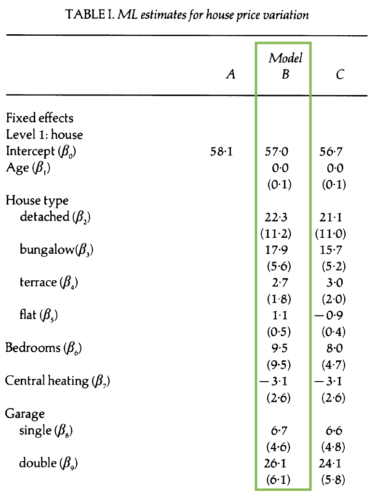

```{r setup, include = F}
knitr::opts_chunk$set(warning = FALSE, 
                      message = FALSE, 
                      fig.width = 8,
                      fig.asp = 0.618, 
                      fig.retina = 3, 
                      dpt = 300, 
                      out.width = "70%",
                      fig.align = "center")

ggplot2::theme_set(ggplot2::theme_bw(base_size = 16))

colors <- tibble::tibble(green = "#B5BA72")
```


```{r echo=FALSE, message=FALSE, warning=FALSE}
library(tidyverse)
library(tidymodels)
library(GGally)
library(xaringanExtra)
library(knitr)
library(patchwork)
library(viridis)
library(ggfortify)
library(kableExtra)
library(lme4)
library(broom.mixed)
```

```{r xaringan-panelset, echo=FALSE}
xaringanExtra::use_panelset()
```

class: middle, center

## [Click here for PDF of slides](22-three-level-models.pdf)

---


## Announcements

- Mini-project 02
  - [Team evaluation & feedback](https://forms.office.com/Pages/ResponsePage.aspx?id=TsVyyzFKnk2xSh6jbfrJTBw0r2_bKCVMs9lST1_-2sxURVJQUVpSWTRMTlM2TjFHVVhaVTVCRjRPSy4u) due on Fri, April 1 at 11:59pm. 
  
- HW 04 due **Fri, Apr 1** at 11:59pm

- Final project - optional draft due **Fri, Apr 15**, final report due **Wed, Apr 27**

[Click here](https://docs.google.com/presentation/d/1uCKhYKMqVXs5qRfvOUr4H3oIsit-B3Ir_AlZiTmLm6g/edit?usp=sharing) for Google slides for exercises.

---

## Learning goals 

- Write form of model for models with more than two levels

- Interpret fixed and random effects at each level 

- See how three-level models are used in data analysis example


---

## Data: Housing prices in Southampton 

.midi[The data includes the price and characteristics for 918 houses sold between 1986 and 1991 in Southampton, England. The data were originally collected from a local real estate agency and were analyzed in the 1991 article ["Specifying and Estimating Multi-Level Models for Geographical Research"](https://sakai.duke.edu/access/content/group/ec265469-bdb3-47a7-beb0-317956b6f86f/jones-1991.pdf) by Kelvyn Jones. The primary variables of interest are] 

- .midi[**price**: Sales price in thousands of ] &#163;
- .midi[**Age**: Age of the house]
- .midi[**Bedrooms**: Number of bedrooms]
- .midi[**House Type**: (semi-detached, detached, bungalow, terrace, flat)]
- .midi[**Central heating**: Whether house has central heating (0: yes, 1: no)]
- .midi[**Garage**: Number of garages (none, single, double)]
- .midi[**Districts**: one of 34 districts (baseline: )]
- .midi[**Half-years**: Half-year periods beginning the second half of 1986]

---

## Data structure

```{r echo = F, fig.cap = "Adapted from Figure 2b from Jones (1991)", fig.align = "center", out.width = "60%"}
knitr::include_graphics("img/figure-2b.png")
```

*Note: The paper uses different symbols to represent parameters than what is in the textbook. The slides will follow the textbook.*

---

## Unconditional means model 

.eq[
$$Y_{ijk} = \alpha_0 + \tilde{u}_i + u_{ij} + \epsilon_{ijk}$$
]

**Level One** (house)

$Y_{ijk} = a_{ij} + \epsilon_{ijk}, \hspace{10mm} \epsilon_{ijk} \sim N(0, \sigma^2)$

**Level Two** (time)

$a_{ij} = a_i + u_{ij}, \hspace{10mm} u_{ij} \sim N(0, \sigma^2_u)$

**Level Three** (district)

$a_{i} = \alpha_0 + \tilde{u}_{i}, \hspace{10mm} \tilde{u}_{i} \sim N(0, \sigma^2_{\tilde{u}})$

---

## Label the terms of the composite model 

- $Y_{ijk}$: Price of house $k^{th}$ sold in the $j^{th}$ time period in district $i$

- $\alpha_0$: 

- $\epsilon_{ijk}$: 

- $u_{ij}$

- $\tilde{u}_i$: 

<hr> 

- $\sigma$: House-to-house variability within a given time period

- $\sigma_{u}$: Variability over time within a district

- $\sigma_{\tilde{u}}$: District-to-district variability 

---

## Model A

.pull-left[
```{r echo = F, fig.align = "center", out.width = "70%"}
knitr::include_graphics("img/fixed-effects-modela.png")
```

<br>

]

.pull-right[
```{r echo = F, fig.align = "center", out.width = "70%"}

```

.question[
Interpret $\hat{\beta}_0$ (this is $\alpha_0$ in our model notation) 
]
]

.footnote[Table 1 from Jones (1991)]

---

## Model A: Random effects

.pull-left[
```{r echo = F, fig.align = "center", out.width = "70%"}

```
]

.pull-right[
.question[
1. Calculate the intraclass correlation for time. 
2. Calculate the intraclass correlation coefficient for districts. 
3. Is there evidence the multilevel model structure is useful for this data?
]
]

---

## Model B: Add covariates + random intercepts


.pull-left[
```{r echo = F, fig.align = "center", out.width = "70%"}

```

<br>

]

.pull-right[
```{r echo = F, fig.align = "center", out.width = "70%"}
knitr::include_graphics("img/random-effects-modelb.png")
```

.question[
1. Write the composite model. 
2. Which variables appear to have a statistically significant effect on price? 
3. Use this model to interpret the covariate assigned to your group.
]
]

.footnote[Table 1 from Jones (1991)]

---

## Model C: Additional random effect

.pull-left[
```{r echo = F, fig.align = "center", out.width = "70%"}

```

<br>

]

.pull-right[
```{r echo = F, fig.align = "center", out.width = "70%"}

```

.question[

1. How does this model differ from Model B? 
2. Write the composite model. 
3. Write the Level One, Level Two, and Level Three models. 
]
]

.footnote[Table 1 from Jones (1991)]

---


## Visualizing price by district over time

.pull-left[
```{r echo = F, fig.align  = "center", fig.cap = "Figure 3 from Jones (1991)", out.width = "100%"}

```
]

.pull-right[
.question[
1. What do you observe from the plot? 
2. What terms in the model can be understood from the plot? 
3. How might you use this type of plot to support decisions you make in the analysis?
]
]
---

## Price by district and bedrooms

.pull-left[
```{r echo = F, out.width = "100%", fig.align = "center", fig.cap = "Figure 4 from Jones (1991)"}
knitr::include_graphics("img/figure-4.png")
```
]

.pull-right[

.question[
1. What do you observe from the plot? 
2. What terms in the model can be understood from the plot? 
3. How might you use this type of plot to support decisions you make in the analysis?
]

.question[
How does our understanding of the effect of bedrooms differ in this model compared to Model B? 
]
]

---

## Acknowledgements

- Jones, K. (1991). [Specifying and estimating multi-level models for geographical research](https://sakai.duke.edu/access/content/group/ec265469-bdb3-47a7-beb0-317956b6f86f/jones-1991.pdf). Transactions of the institute of British geographers, 148-159.
  
- Beyond Multiple linear regression 
  - [Chapter 10: Multilevel data with more than two levels](https://bookdown.org/roback/bookdown-BeyondMLR/ch-3level.html)