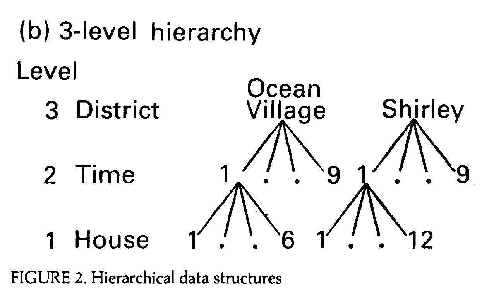

```{r setup, include = F}
knitr::opts_chunk$set(warning = FALSE, 
                      message = FALSE, 
                      fig.width = 8,
                      fig.asp = 0.618, 
                      fig.retina = 3, 
                      dpt = 300, 
                      out.width = "70%",
                      fig.align = "center")

ggplot2::theme_set(ggplot2::theme_bw(base_size = 16))

colors <- tibble::tibble(green = "#B5BA72")
```


```{r echo=FALSE, message=FALSE, warning=FALSE}
library(tidyverse)
library(tidymodels)
library(GGally)
library(xaringanExtra)
library(knitr)
library(patchwork)
library(viridis)
library(ggfortify)
library(kableExtra)
library(lme4)
library(broom.mixed)
```

```{r xaringan-panelset, echo=FALSE}
xaringanExtra::use_panelset()
```

class: middle, center

## [Click here for PDF of slides](23-three-level-models-pt2.pdf)

---


## Announcements

- Final project - optional draft due **Fri, Apr 15**, final report due **Wed, Apr 27**

[Click here](https://docs.google.com/presentation/d/1uCKhYKMqVXs5qRfvOUr4H3oIsit-B3Ir_AlZiTmLm6g/edit?usp=sharing) for Google slides for exercises.

---

## Learning goals 

- Write form of model for models with more than two levels

- Interpret fixed and random effects at each level 

- See how three-level models are used in data analysis example

- Use the model to understand the covariance structure among observations


---

## Data: Housing prices in Southampton 

.midi[The data includes the price and characteristics for 918 houses sold between 1986 and 1991 in Southampton, England. The data were originally collected from a local real estate agency and were analyzed in the 1991 article ["Specifying and Estimating Multi-Level Models for Geographical Research"](https://sakai.duke.edu/access/content/group/ec265469-bdb3-47a7-beb0-317956b6f86f/jones-1991.pdf) by Kelvyn Jones. The primary variables of interest are] 

- .midi[**price**: Sales price in thousands of ] &#163;
- .midi[**Age**: Age of the house]
- .midi[**Bedrooms**: Number of bedrooms]
- .midi[**House Type**: (semi-detached, detached, bungalow, terrace, flat)]
- .midi[**Central heating**: Whether house has central heating (0: yes, 1: no)]
- .midi[**Garage**: Number of garages (none, single, double)]
- .midi[**Districts**: one of 34 districts (baseline: )]
- .midi[**Half-years**: Half-year periods beginning the second half of 1986]

---

## Data structure

```{r echo = F, fig.cap = "Adapted from Figure 2b from Jones (1991)", fig.align = "center", out.width = "60%"}

```

*Note: The paper uses different symbols to represent parameters than what is in the textbook. The slides will follow the textbook.*

---

class: middle, inverse 

## Recap

---

## Unconditional means model 

.eq[
$$Y_{ijk} = \alpha_0 + \tilde{u}_i + u_{ij} + \epsilon_{ijk}$$
]

.pull-left[
```{r echo = F, fig.align = "center", out.width = "100%"}

```
]

**Level Three**

$a_{i} = \alpha_0 + \tilde{u}_{i}, \hspace{10mm} \tilde{u}_{i} \sim N(0, \sigma^2_{\tilde{u}})$

**Level Two**

$a_{ij} = a_i + u_{ij}, \hspace{10mm} u_{ij} \sim N(0, \sigma^2_u)$


**Level One**

$Y_{ijk} = a_{ij} + \epsilon_{ijk}, \hspace{10mm} \epsilon_{ijk} \sim N(0, \sigma^2)$


---

## Model A: Unconditional means model

.pull-left[
```{r echo = F, fig.align = "center", out.width = "70%"}

```

<br>

]

.pull-right[
```{r echo = F, fig.align = "center", out.width = "70%"}
knitr::include_graphics("img/random-effects-modela.png")
```

.alert[
The overall mean price of houses in this data set is &#163; 58,100
]
]

.footnote[Table 1 from Jones (1991)]

---

## Model A: Random effects

.pull-left[
```{r echo = F, fig.align = "center", out.width = "70%"}
knitr::include_graphics("img/random-effects-modela.png")
```
]

.pull-right[
$$\begin{aligned}&\hat{\rho}_{time} = \frac{169}{397 + 169 + 240} = 0.210 \\[20pt]
&\hat{\rho}_{district} = \frac{240}{397 + 169 + 240} = 0.298\end{aligned}$$
]

---

class: middle, inverse

## Model with covariates

---

## Model B: Add covariates + random intercepts


.pull-left[
```{r echo = F, fig.align = "center", out.width = "70%"}
knitr::include_graphics("img/fixed-effects-modelb.png")
```

<br>

]

.pull-right[
```{r echo = F, fig.align = "center", out.width = "70%"}

```

.question[
1. Write the composite model. 
2. [Click here](https://docs.google.com/presentation/d/1uCKhYKMqVXs5qRfvOUr4H3oIsit-B3Ir_AlZiTmLm6g/edit?usp=sharing) to interpret the covariate assigned to your group. 
]
]

.footnote[Table 1 from Jones (1991)]

---

## Model C: Additional random effect

.pull-left[
```{r echo = F, fig.align = "center", out.width = "70%"}
knitr::include_graphics("img/fixed-effects-modelc.png")
```

<br>

]

.pull-right[
```{r echo = F, fig.align = "center", out.width = "70%"}
knitr::include_graphics("img/random-effects-modelc.png")
```

.question[

1. How does this model differ from Model B? 
2. Write the composite model. 
3. Write the Level One, Level Two, and Level Three models. 
]
]

.footnote[Table 1 from Jones (1991)]

---


## Visualizing price by district over time

.pull-left[
```{r echo = F, fig.align  = "center", fig.cap = "Figure 3 from Jones (1991)", out.width = "100%"}
knitr::include_graphics("img/figure-3.png")
```
]

.pull-right[
.question[
1. What do you observe from the plot? 
2. What terms in the model can be understood from the plot? 
3. How might you use this type of plot to support decisions you make in the analysis?

[Click here](https://docs.google.com/presentation/d/1uCKhYKMqVXs5qRfvOUr4H3oIsit-B3Ir_AlZiTmLm6g/edit?usp=sharing) to submit your group's response.
]
]

---

## Price by district and bedrooms

.pull-left[
```{r echo = F, out.width = "100%", fig.align = "center", fig.cap = "Figure 4 from Jones (1991)"}

```
]

.pull-right[

.question[
1. What do you observe from the plot? 
2. What terms in the model can be understood from the plot? 
3. How might you use this type of plot to support decisions you make in the analysis?

[Click here](https://docs.google.com/presentation/d/1uCKhYKMqVXs5qRfvOUr4H3oIsit-B3Ir_AlZiTmLm6g/edit?usp=sharing) to submit your group's response. 
]
]

---

class: middle

.question[
Based on the output and visualizations, how does our understanding of the effect of bedrooms differ in Model C compared to Model B? 
]

---

class: middle, inverse

## Covariance structure of observations 

---

## What we've done

So far we have discussed...

- the covariance structure between error terms at a given level, e.g. the relationship between $u_i$ and $v_i$ from a Level Two model: 

$$\left[ \begin{array}{c}
            u_{i} \\ v_{i}
          \end{array}  \right] \sim N \left( \left[
          \begin{array}{c}
            0 \\ 0
          \end{array} \right], \left[
          \begin{array}{cc}
            \sigma_{u}^{2} & \sigma_{uv} \\
            \sigma_{uv} & \sigma_{v}^{2}
          \end{array} \right] \right)$$

-  how to use the intraclass correlation coefficient to get an idea of the average correlation among observations nested in the same Level Two and/or Level Three observations

---

## Questions we want to answer

Now we want to be able to answer more specific questions about the covariance structure between *observations* at different levels. 

--

- What is the covariance structure of houses in the same district sold in different time periods? $(Y_{ij}, Y_{ij'})$

--

- What is the covariance structure of houses in the same district sold in the same time period? $(Y_{ijk}, Y_{ijk'})$

--
  - How does this structure differ between Model B and Model C in Jones (1991)?

---

## Calculating variance and covariance

Suppose $Y_1 = a_1 X_1 + a_2 X_2 + a_3$ and $Y_2 = b_1 X_1 + b_2 X_2 + b_3$ where $X_1$ and $X_2$ are random variables and $a_i$ and $b_i$ are constants for $i = 1, 2, 3$, then we know from probability theory that:

.alert[
.midi[
$${\small\begin{aligned}Var(Y_1) & = a^{2}_{1} Var(X_1) + a^{2}_{2} Var(X_2) + 2 a_1 a_2 Cov(X_1,X_2) \\[10pt]
Cov(Y_1,Y_2) & = a_1 b_1 Var(X_1) + a_2 b_2 Var(X_2) + (a_1 b_2 + a_2 b_1) Cov(X_1,X_2)\end{aligned}}$$

*Note: This extends beyond two random variables*
]
]

We will use these properties to define the covariance structure of the observations in the model. 


.footnote[.small[from [BMLR: Section 9.7.5](https://bookdown.org/roback/bookdown-BeyondMLR/ch-lon.html#optionalcov)]]
---

## Covariance structure under Model B

Let $Y_{ijk}$ be the sales price for the house $k$ in district $i$ sold in time period $j$, and $x_1, \ldots, x_9$ be the house-level covariates. 

.alert[
$$Y_{ijk} = \alpha_0 + \sum_{i = 1}^{9}\alpha_ix_i + [\tilde{u}_i + u_{ij} + \epsilon_{ijk}]$$
$$\tilde{u}_i \sim N(0, \sigma_{\tilde{u}}^2), \hspace{5mm} u_{ij} \sim N(0, \sigma^2_{u}), \hspace{5mm} \epsilon_{ijk} \sim N(0, \sigma^2)$$ 
]

Only use the random effects portion of the model in the variance and covariance derivations.

---

## Variance and covariance derivations

.middle[
.question[
Use Model B to write the derivation of $Var(Y_{ijk})$, the variance of an individual observation.
]
]

---

## Variance and covariance derivations

.middle[
.question[
Use Model B to write the derivation of $Cov(Y_{ijk}, Y_{ijk'})$, the covariance between houses sold in the same time period that are in the same district.
]
]

---

## Variance and covariance derivations

.question[
Write the derivation of $Cov(\textbf{Y}_{ij})$, the covariance matrix for houses sold in the same time period that are in the same district. 
]

---

## Looking ahead 

- Calculate the correlation matrix

- Data analysis with three-level models 

- Multilevel GLMs

---

## Acknowledgements

- Jones, K. (1991). [Specifying and estimating multi-level models for geographical research](https://sakai.duke.edu/access/content/group/ec265469-bdb3-47a7-beb0-317956b6f86f/jones-1991.pdf). Transactions of the institute of British geographers, 148-159.
  
- Beyond Multiple linear regression 
  - [Section 9.7: Covariance structure among observations](https://bookdown.org/roback/bookdown-BeyondMLR/ch-lon.html#errorcovariance)
  - [Chapter 10: Multilevel data with more than two levels](https://bookdown.org/roback/bookdown-BeyondMLR/ch-3level.html)