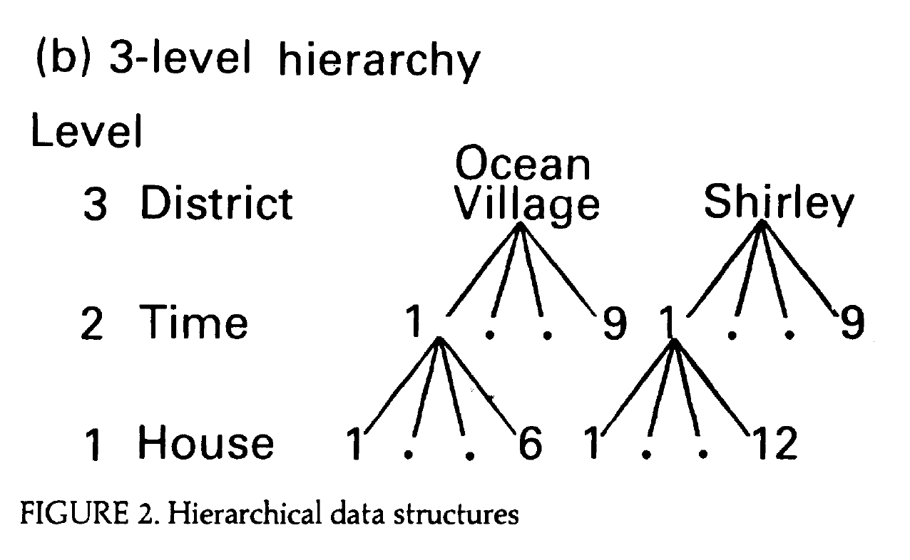

```{r setup, include = F}
knitr::opts_chunk$set(warning = FALSE, 
                      message = FALSE, 
                      fig.width = 8,
                      fig.asp = 0.618, 
                      fig.retina = 3, 
                      dpt = 300, 
                      out.width = "70%",
                      fig.align = "center")

ggplot2::theme_set(ggplot2::theme_bw(base_size = 16))

colors <- tibble::tibble(green = "#B5BA72")
```


```{r echo=FALSE, message=FALSE, warning=FALSE}
library(tidyverse)
library(tidymodels)
library(GGally)
library(xaringanExtra)
library(knitr)
library(patchwork)
library(viridis)
library(ggfortify)
library(kableExtra)
library(lme4)
library(broom.mixed)
```

```{r xaringan-panelset, echo=FALSE}
xaringanExtra::use_panelset()
```

class: middle, center

## [Click here for PDF of slides](24-covariance-structure.pdf)

---


## Announcements

- Final project - optional draft due **Fri, Apr 15**, final report due **Wed, Apr 27**


---

## Learning goals 

- Use the model to understand the covariance structure among observations


---

## Data: Housing prices in Southampton 

.midi[The data includes the price and characteristics for 918 houses sold between 1986 and 1991 in Southampton, England. The data were originally collected from a local real estate agency and were analyzed in the 1991 article ["Specifying and Estimating Multi-Level Models for Geographical Research"](https://sakai.duke.edu/access/content/group/ec265469-bdb3-47a7-beb0-317956b6f86f/jones-1991.pdf) by Kelvyn Jones. The primary variables of interest are] 

- .midi[**price**: Sales price in thousands of ] &#163;
- .midi[**Age**: Age of the house]
- .midi[**Bedrooms**: Number of bedrooms]
- .midi[**House Type**: (semi-detached, detached, bungalow, terrace, flat)]
- .midi[**Central heating**: Whether house has central heating (0: yes, 1: no)]
- .midi[**Garage**: Number of garages (none, single, double)]
- .midi[**Districts**: one of 34 districts (baseline: )]
- .midi[**Half-years**: Half-year periods beginning the second half of 1986]

---

## Data structure

```{r echo = F, fig.cap = "Adapted from Figure 2b from Jones (1991)", fig.align = "center", out.width = "60%"}

```

*Note: The paper uses different symbols to represent parameters than what is in the textbook. The slides will follow the textbook.*

---

## Model A (unconditional means model)

$$Y_{ijk} = \alpha_0 + \tilde{u}_i + u_{ij} + \epsilon_{ijk} \\[10pt]
\tilde{u}_{i} \sim N(0, \sigma^2_{\tilde{u}}), \hspace{5mm} u_{ij} \sim N(0, \sigma^2_u), \hspace{5mm}\epsilon_{ijk} \sim N(0, \sigma^2)$$

<br> 

[Click here](https://sta310-sp22.github.io/slides/supplemental-notes/jones1991-models.html#model-a-unconditional-means-model) for model details.

---

## Model B

$$\begin{aligned}Y_{ijk} = \alpha_0 &+ \beta_1 \text{age}_{ijk} + \beta_2 \text{detached}_{ijk} + \beta_3 \text{bungalow}_{ijk} + \beta_4 \text{terrace}_{ijk} \\ &+ \beta_5 \text{flat}_{ijk}+ \beta_6 
\text{bedrooms}_{ijk} + \beta_7 \text{central heating}_{ijk}\\ &+ \beta_8 \text{single}_{ijk} + \beta_9 \text{double}_{ijk}\\ &+ [\tilde{u}_i + u_{ij} + \epsilon_{ijk}]\end{aligned}$$

<br>

$$\tilde{u}_{i} \sim N(0, \sigma^2_{\tilde{u}}), \hspace{5mm} u_{ij} \sim N(0, \sigma^2_u), \hspace{5mm}\epsilon_{ijk} \sim N(0, \sigma^2)$$
<br>

[Click here](https://sta310-sp22.github.io/slides/supplemental-notes/jones1991-models.html#model-b) for model details.

---

## Model C

$$\begin{aligned}Y_{ijk} = \alpha_0 &+ \beta_1 \text{age}_{ijk} + \beta_2 \text{detached}_{ijk} + \beta_3 \text{bungalow}_{ijk} + \beta_4 \text{terrace}_{ijk} \\ &+ \beta_5 \text{flat}_{ijk}+ \beta_6 
\text{bedrooms}_{ijk} + \beta_7 \text{central heating}_{ijk} \\ &+ \beta_8 \text{single}_{ijk} + \beta_9 \text{double}_{ijk} \\ &+ [\tilde{u}_i + \tilde{v}_i \text{bedrooms}_{ijk} +  u_{ij} + \epsilon_{ijk}]\end{aligned}$$

<br> 

$$\left[ \begin{array}{c}
            \tilde{u}_{i} \\ \tilde{v}_{i}
          \end{array}  \right] \sim N \left( \left[
          \begin{array}{c}
            0 \\ 0
          \end{array} \right], \left[
          \begin{array}{cc}
            \sigma_{\tilde{u}}^{2} & \sigma_{\tilde{u}\tilde{v}} \\
            \sigma_{\tilde{u}\tilde{v}} & \sigma_{\tilde{v}}^{2}
          \end{array} \right] \right)
, \hspace{5mm} u_{ij} \sim N(0, \sigma^2_u), \hspace{5mm}\epsilon_{ijk} \sim N(0, \sigma^2)$$

<br> 

[Click here](https://sta310-sp22.github.io/slides/supplemental-notes/jones1991-models.html#model-c) for model details. 


---

class: middle, inverse

## Covariance structure of observations 

---

## What we've done

So far we have discussed...

- the covariance structure between error terms at a given level, e.g. the distribution of between $\tilde{u}_i$ and $\tilde{v}_i$ from a Level Two model: 

$$\left[ \begin{array}{c}
            \tilde{u}_{i} \\ \tilde{v}_{i}
          \end{array}  \right] \sim N \left( \left[
          \begin{array}{c}
            0 \\ 0
          \end{array} \right], \left[
          \begin{array}{cc}
            \sigma_{\tilde{u}}^{2} & \sigma_{\tilde{u}\tilde{v}} \\
            \sigma_{\tilde{u}\tilde{v}} & \sigma_{\tilde{v}}^{2}
          \end{array} \right] \right)$$

-  how to use the intraclass correlation coefficient to get an idea of the average correlation among observations nested in the same Level Two and/or Level Three observations

---

## Questions we want to answer

Now we want to be able to answer more specific questions about the covariance (and correlation) structure of *observations* at different levels. 

- What is the covariance (and correlation) of houses in the same district sold in the same time period? $(Y_{ijk}, Y_{ijk'})$

- What is the covariance (and correlation) of houses in the same district sold in different time periods? $(Y_{ijk}, Y_{ij'k'})$

--

<hr> 

- What is the covariance structure of houses in the same district? 
- What is the covariance structure of houses in the same district sold in the same time period? 

--

<hr>

How do these values differ between Model B and Model C in Jones (1991)?

---

## Calculating variance and covariance

Suppose $Y_1 = a_1 X_1 + a_2 X_2 + a_3$ and $Y_2 = b_1 X_1 + b_2 X_2 + b_3$ where $X_1$ and $X_2$ are random variables and $a_i$ and $b_i$ are constants for $i = 1, 2, 3$, then we know from probability theory that:

.alert[
.midi[
$${\small\begin{aligned}Var(Y_1) & = a^{2}_{1} Var(X_1) + a^{2}_{2} Var(X_2) + 2 a_1 a_2 Cov(X_1,X_2) \\[10pt]
Cov(Y_1,Y_2) & = a_1 b_1 Var(X_1) + a_2 b_2 Var(X_2) + (a_1 b_2 + a_2 b_1) Cov(X_1,X_2)\end{aligned}}$$

*Note: This extends beyond two random variables*
]
]

We will use these properties to define the covariance structure of the observations in the model. 


.footnote[.small[from [BMLR: Section 9.7.5](https://bookdown.org/roback/bookdown-BeyondMLR/ch-lon.html#optionalcov)]]
---

## Calculating covariances from Model B

.alert[
$$\begin{aligned}Y_{ijk} = \alpha_0 &+ \beta_1 \text{age}_{ijk} + \beta_2 \text{detached}_{ijk} + \beta_3 \text{bungalow}_{ijk} + \beta_4 \text{terrace}_{ijk} \\ &+ \beta_5 \text{flat}_{ijk} + \beta_6 
\text{bedrooms}_{ijk} + \beta_7 \text{central heating}_{ijk} \\ &+ \beta_8 \text{single}_{ijk} + \beta_9 \text{double}_{ijk}\\ &+ [\tilde{u}_i + u_{ij} + \epsilon_{ijk}]\end{aligned}$$

<br>

$$\tilde{u}_{i} \sim N(0, \sigma^2_{\tilde{u}}), \hspace{5mm} u_{ij} \sim N(0, \sigma^2_u), \hspace{5mm}\epsilon_{ijk} \sim N(0, \sigma^2)$$
]

Only use the random effects portion of the model in the variance and covariance derivations.

---

.middle[
.question[
Use Model B to write the derivation of $Var(Y_{ijk})$, the variance of an individual observation. Then calculate $\hat{Var}(Y_{ijk})$. 

$$\hat{\sigma}^2 = 236 \hspace{10mm} \hat{\sigma}^2_{u} = 139
\hspace{10mm} \hat{\sigma}^2_{\tilde{u}} = 201$$
]
]

---

.middle[
.question[
Use Model B to write the derivation of $Cov(Y_{ijk}, Y_{ijk'})$, the covariance of houses in the same district sold in the same time period. Then calculate $\hat{Cov}(Y_{ijk}, Y_{ijk'})$. 

$$\hat{\sigma}^2 = 236 \hspace{10mm} \hat{\sigma}^2_{u} = 139
\hspace{10mm} \hat{\sigma}^2_{\tilde{u}} = 201$$
]
]

---

.middle[
.question[
Use Model B to write the derivation of $Cov(Y_{ijk}, Y_{ij'k'})$, the covariance of houses in the same district sold in different time periods. Then calculate $\hat{Cov}(Y_{ijk}, Y_{ij'k'})$. 

$$\hat{\sigma}^2 = 236 \hspace{10mm} \hat{\sigma}^2_{u} = 139
\hspace{10mm} \hat{\sigma}^2_{\tilde{u}} = 201$$

[Click here](https://forms.gle/6hYayoj1BM1o2fKh8) to submit your response.
]
]

```{r echo = F}
library(countdown)
countdown(minutes = 4, seconds = 0,
          margin = "5%")
```

---

## Correlation between observations 

.alert[
Recall, $$Corr(Y_1, Y_2) = \frac{Cov(Y_1, Y_2)}{\sqrt{Var(Y_1)Var(Y_2)}}$$
]

.question[
1. What is the estimated correlation between houses in the same district sold in the same time period?

2. What is the estimated correlation between houses in the same district sold in different time periods? 
]


---

## Covariance structure

Write $Cov(\textbf{Y}_{ij})$, the covariance matrix for observations from houses sold in the same time period that are in the same district. 

$$\small{Cov(\textbf{Y}_{ij}) = \left[
          \begin{array}{ccccc}
            \tau_1 & & & & \\
           \tau_{12} & \tau_2 & & & \\
            \tau_{13} &\tau_{23} &  \tau_3 & \\
             \vdots & \vdots & \vdots  & \ddots & \\
            \tau_{1n_{ij}} & \tau_{2n_{ij}} & \tau_{3n_{ij}}&  \ldots & \tau_{n_{ij}}
          \end{array} \right]}$$

<br> 

where $\tau_{k}^2 = Var(Y_{ijk})$, $\tau_{kk'} = Cov(Y_{ijk}, Y_{ijk'})$, and  $n_{ij}$ is the number of houses sold in the $i^{th}$ district in the $j^{th}$ time period. 

---

## Correlation matrix

.question[
Write the correlation matrix for houses from the same district that were sold in the same time period.
]

---

class: middle, inverse

## Covariance of observations in Model C

---

## Model C

.alert[
$$\begin{aligned}Y_{ijk} = \alpha_0 &+ \beta_1 \text{age}_{ijk} + \beta_2 \text{detached}_{ijk} + \beta_3 \text{bungalow}_{ijk} + \beta_4 \text{terrace}_{ijk}\\ &+  \beta_5 \text{flat}_{ijk}+ \beta_6 
\text{bedrooms}_{ijk} + \beta_7 \text{central heating}_{ijk} \\ &+ \beta_8 \text{single}_{ijk} + \beta_9 \text{double}_{ijk}\\ &+ [\tilde{u}_i + \tilde{v}_i \text{bedrooms}_{ijk} +  u_{ij} + \epsilon_{ijk}]\end{aligned}$$

$$\left[ \begin{array}{c}
            \tilde{u}_{i} \\ \tilde{v}_{i}
          \end{array}  \right] \sim N \left( \left[
          \begin{array}{c}
            0 \\ 0
          \end{array} \right], \left[
          \begin{array}{cc}
            \sigma_{\tilde{u}}^{2} & \sigma_{\tilde{u}\tilde{v}} \\
            \sigma_{\tilde{u}\tilde{v}} & \sigma_{\tilde{v}}^{2}
          \end{array} \right] \right)
, \hspace{5mm} u_{ij} \sim N(0, \sigma^2_u), \hspace{5mm}\epsilon_{ijk} \sim N(0, \sigma^2)$$
]

---

.middle[
.question[
Use Model C to write the derivation of $Var(Y_{ijk})$, the variance of an individual observation. Then calculate $\hat{Var}(Y_{ijk})$ for a house with two bedrooms.

$$\hat{\sigma}^2 = 215 \hspace{10mm} \hat{\sigma}^2_{u} = 127 \\
\hat{\sigma}^2_{\tilde{u}} = 213 \hspace{10mm}  \hat{\sigma}^2_{\tilde{v}} = 58 \hspace{10mm} \hat{\sigma}_{\tilde{u}\tilde{v}} =  111$$
]
]

---

.middle[
.question[
Use Model C to write the derivation of $Cov(Y_{ijk}, Y_{ijk'})$, the covariance of houses in the same district sold in the same time period. Then calculate $\hat{Cov}(Y_{ijk}, Y_{ijk'})$ for two houses that each have two bedrooms.

$$\hat{\sigma}^2 = 215 \hspace{10mm} \hat{\sigma}^2_{u} = 127 \\
\hat{\sigma}^2_{\tilde{u}} = 213 \hspace{10mm}  \hat{\sigma}^2_{\tilde{v}} = 58 \hspace{10mm} \hat{\sigma}_{\tilde{u}\tilde{v}} =  111$$
]
]

---

.middle[
.question[
Use Model C to write the derivation of $Cov(Y_{ijk}, Y_{ij'k'})$, houses in the same district sold in different time periods. Then calculate $\hat{Cov}(Y_{ijk}, Y_{ij'k'})$. 

$$\hat{\sigma}^2 = 215 \hspace{10mm} \hat{\sigma}^2_{u} = 127 \\
\hat{\sigma}^2_{\tilde{u}} = 213 \hspace{10mm}  \hat{\sigma}^2_{\tilde{v}} = 58 \hspace{10mm} \hat{\sigma}_{\tilde{u}\tilde{v}} =  111$$
]
]

```{r echo = F}
library(countdown)
countdown(minutes = 4, seconds = 0,
          margin = "5%")
```

---

## Correlation between observations 

.alert[
Recall, $$Corr(Y_1, Y_2) = \frac{Cov(Y_1, Y_2)}{\sqrt{Var(Y_1)Var(Y_2)}}$$
]

.question[

1. What is the estimated correlation between two houses each with two bedrooms in the same district sold in the same time period? 

2. What is the correlation between a house with two bedrooms and one with three bedrooms in the same district sold in the same time period? 
]


---

.question[
1. What is the estimated correlation between two houses each with two bedrooms in the same district sold in <u>different</u> time periods?

2. What is the correlation between a house with two bedrooms and one with three bedrooms in the same district sold in <u>different</u> time periods?

[Click here](https://forms.gle/AB48iCxomU8Gs5kz8) to submit your response.
]


```{r echo = F}
library(countdown)
countdown(minutes = 6, seconds = 0,
          margin = "5%")
```

---
class: middle

.question[
Which covariance structure do you think is most reasonable for the data? The variance structure imposed by Model B or the one imposed by Model C?
]

---


class: middle, inverse

## Alternative covariance structures

---

## Different covariance structures

The standard covariance structure calculated from the multilevel model is useful in most situations. Sometimes, however, there may be a different covariance structure that better fits the data. A few alternatives are

**Unstructured**: Every variance and covariance term for observations with each level is a separate parameter and is uniquely estimated. No patterns among variances or correlations are assumed. Very flexible but requires the estimation of many parameters. 

**Compound Symmetry**: Assume variance is constant across all Level One observations and correlation is constant across all pairs of Level One observations. Restrictive but few parameters to estimate. 

---

## Different covariance structures

**Autoregressive**: Assume constant variance across all time points, but correlation reduces in a systematic way such that closer time points are more correlated than those further apart. 

**Toeplitz**: Similar to autoregressive but there is no imposed structure on the decreased correlation for time periods further apart. 

**Heterogeneous variances**: Allows for equal variances across time points. Requires additional parameters to be estimated to allow for the unequal variances.  

<br>

.small[See ["Fitting Linear Mixed Models in R"](http://staff.pubhealth.ku.dk/~jufo/courses/rm2018/nlmePackage.pdf) for details on R packages and code for multilevel models with a predetermined covariance structure, and [Section 9.7.2 Alternative Covariance Structures]((https://bookdown.org/roback/bookdown-BeyondMLR/ch-lon.html#alternateerror) in BMLR for more details.]

---

## Acknowledgements

- Jones, K. (1991). [Specifying and estimating multi-level models for geographical research](https://sakai.duke.edu/access/content/group/ec265469-bdb3-47a7-beb0-317956b6f86f/jones-1991.pdf). Transactions of the institute of British geographers, 148-159.

- ["Fitting Linear Mixed Models in R"](http://staff.pubhealth.ku.dk/~jufo/courses/rm2018/nlmePackage.pdf) by Brice Ozenne
  
- Beyond Multiple linear regression 
  - [Section 9.7: Covariance structure among observations](https://bookdown.org/roback/bookdown-BeyondMLR/ch-lon.html#errorcovariance)
  - [Section 10.9: Covariance structure](https://bookdown.org/roback/bookdown-BeyondMLR/ch-3level.html#error-3level)